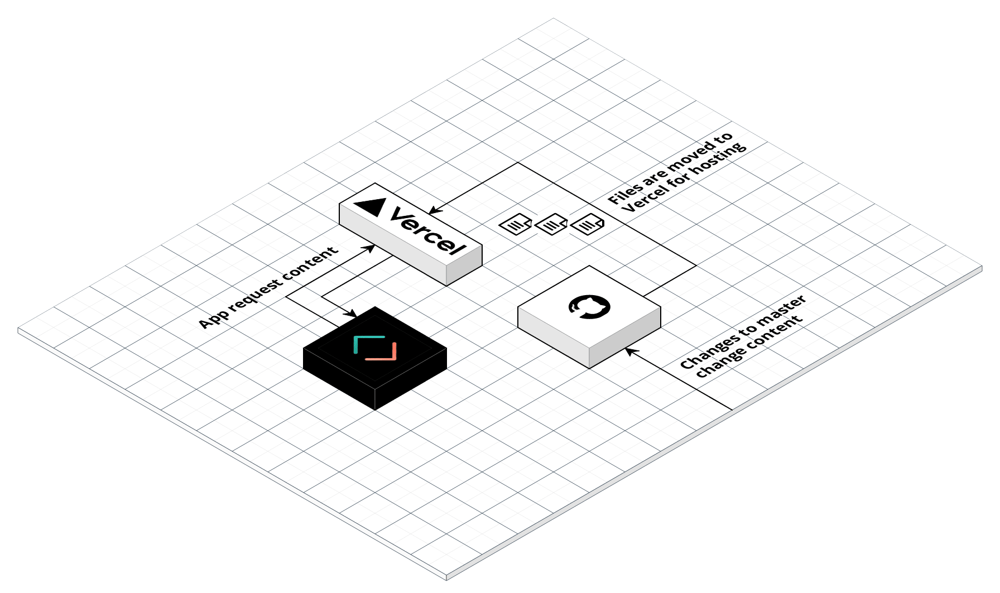
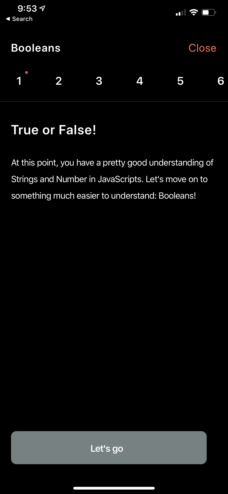
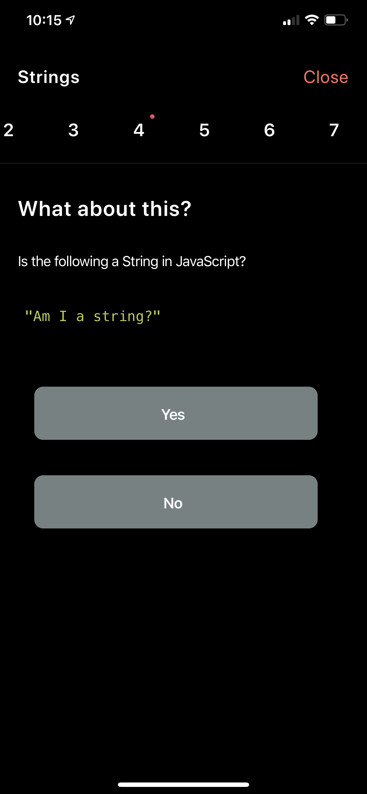
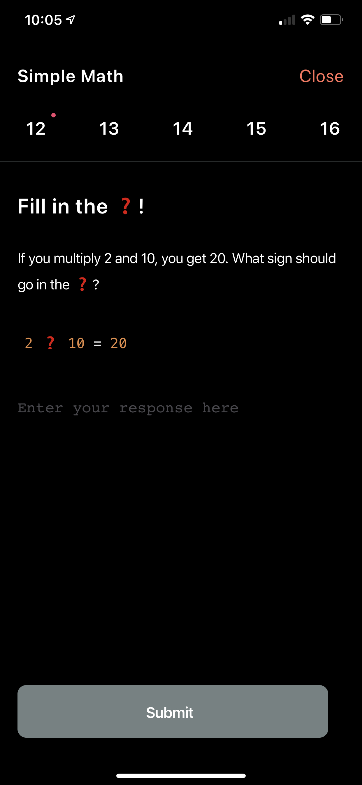

<h1 align="center">👩🏽‍🏫 Teacher</h1>

Content delivery for [Cursor](https://github.com/awaseem/cursor)

Development Environment: [teacher-dev.getcursor.app](https://teacher-dev.getcursor.app/)

Production Environment: [teacher.getcursor.app](https://teacher.getcursor.app/)

# How does it work?

Any changes to master will trigger a redeploy within vercel that hosts the data files. The app calls these files like any other API, parses them and then presents the content.

This way if I need to change anything related to the courses or content, I just make a small commit into master and boom everything is redeployed. The best part is this **costs me zero dollars** and get a bunch of added features like caching and worldwide CDN support.



# Playground

Instead of writing the JSON files manually, you can use the built in playground to help with writing the Courses. **Note this is super experimental, does not save the data locally. You'll need to manually copy and paste the content into JSON files**

To run the playground simply install all the dependencies and run the start script:

```
npm install && npm start
```

# Contributing

Teacher is an open source project, and contributions of any kind are welcome and appreciated. Open issues, bugs, and feature requests are all listed on the issues tab and labeled accordingly. Feel free to open bug tickets and make feature requests. Please follow these small rules to ensure everything can produced smoothly, can't wait to see your work!

- When submitting work, please ensure to create a pull request with pictures or videos showcasing the changes to the app (if any visual changes).
- Ensure to run the prettier and eslint within you text editor

Have fun and don't be afraid to reach out for any questions or concerns. If you want to add or modify courses or subjects, it's best to understand how the data gets transformed within the app. Please use the following as a reference for modifications to the `data` folder

### Terminology

**Courses** are a list of available teachings for the user to understand. A course is made of multiple **Course Items**. All the course Items are just JSON entities within a list that make up a single **Course**.For example: the boolean course within `data/v1/subjects/javascript/courses/booleans.json` has a list of course items.

A **subject** is comprised of a list of **Courses**. A subject is usually defining the theme of all the courses available. For example: The JavaScript subject within `data/v1/subjects/javascript` has a list of courses related to understanding the language.

### Courses to Screens

The app can only understand three different types of JSON objects for the course items. Any thing new would require an API change, hence `v1` for the current API. Use the following to understand what is displayed with the JSON entity.

#### Outline

An outline course item will produce a screen that can describe content to the user.

| key        | description                                                    | required |
| ---------- | -------------------------------------------------------------- | -------- |
| type       | Can only be "outline"                                          | Yes      |
| title      | The title of the course                                        | Yes      |
| content    | The content that describes what you are trying to teach        | Yes      |
| code       | The code to help with the content                              | No       |
| buttonText | Text of the button displayed                                   | Yes      |
| marker     | The emoji displayed when the user holds the button to continue | Yes      |

```
{
  "type": "outline",

  "title": "True or False!",

  "content": "At this point, you have a pretty good understanding of Strings and Number in JavaScripts. Let's move on to something much easier to understand: Booleans!",

  "buttonText": "Let's go",

  "marker": "👍"
}
```

<p align="center">
  
</p>

#### Multiple Choice

A multiple choice course item will produce a question to the user, will an n number of buttons as possible responses.

| key                    | description                                                                                                                 | required |
| ---------------------- | --------------------------------------------------------------------------------------------------------------------------- | -------- |
| type                   | Can only be "codingInputChoice"                                                                                             | Yes      |
| title                  | The title of the course                                                                                                     | Yes      |
| content                | The content that describes what you are trying to ask                                                                       | Yes      |
| code                   | The code to help with the content, best to use ❓for any fill in the blank style inputs                                     | No       |
| answers                | A list of answers to the questions                                                                                          | Yes      |
| answers -> content     | The text of the button for one of the choices                                                                               | Yes      |
| answers -> correct     | Boolean value indicating whether this answer is correct or not, selecting a correct answer proceeds to the next Course Item | Yes      |
| answers -> explanation | If the course is not correct, an explanation as to why that is                                                              | No       |

```
{
  "type": "choice",

  "title": "What about this?",

  "content": "Is the following a String in JavaScript?",

  "code": "\"Am I a string?\"",

  "answers": [
    {
      "content": "Yes",

      "correct": true
    },
    {
      "content": "No",

      "correct": false,

      "explanation": "A string is an sequence of characters wrapped in a single or double quote"
    }
  ]
}
```

<p align="center">
  
</p>

#### Input

An input course item will produce a screen that asks the user for a text input.

| key              | description                                                                             | required |
| ---------------- | --------------------------------------------------------------------------------------- | -------- |
| type             | Can only be "codingInputChoice"                                                         | Yes      |
| title            | The title of the course                                                                 | Yes      |
| content          | The content that describes what you are trying to ask                                   | Yes      |
| code             | The code to help with the content, best to use ❓for any fill in the blank style inputs | Yes      |
| expectedResponse | The value the user is expected to type, it should match and casing is ignored           | Yes      |

```
{
  "type": "codingInputChoice",

  "title": "Fill in the ❓!",

  "content": "If you multiply 2 and 10, you get 20. What sign should go in the ❓?",

  "code": "2 ❓ 10 = 20",

  "expectedResponse": "*"
}
```

<p align="center">
  
</p>

### Creating Courses

A course is just made of different course items, when you want to add a new course make sure you add it the course list file for that specific subject.

For example, if I was to add a new course named 'my new cool course', I would create a JSON file within `data/v1/subjects/javascript/courses/` and then add the entry within the course list file here: `data/v1/subjects/javascript/courseList.json`. The new JSON object I add has to have the following:

| key         | description                                                                                               | required |
| ----------- | --------------------------------------------------------------------------------------------------------- | -------- |
| id          | Unique ID that no other courses match within the data folder, an easy ID is the subject + the course name | Yes      |
| name        | The display name of the course                                                                            | Yes      |
| description | Short description about the course                                                                        | Yes      |
| emoji       | An emoji that best describes this course                                                                  | Yes      |
| path        | Straight path from the version folder to this course                                                      | Yes      |

```
{
  "id": "javascript-myNewCoolCourse",
  "name": "my new cool course",
  "description": "This is my new cool course",
  "emoji": "🧵",
  "path": "/subjects/javascript/courses/myNewCoolCourse.json"
}
```

### Creating Subjects

Creating a new subject is very similar to creating a new course. Just create a new folder within `data/v1/subjects/` and a new course list file describing all the courses available and their paths. Once that's done, add a new entry to the subject list file `data/v1/subjects/subjectList.json`

| key         | description                                           | required |
| ----------- | ----------------------------------------------------- | -------- |
| id          | Unique ID that no other subject has                   | Yes      |
| name        | The display name of the subject                       | Yes      |
| description | Short description about the subject                   | Yes      |
| emoji       | An emoji that best describes this subject             | Yes      |
| path        | Straight path from the version folder to this subject | Yes      |
| color       | A color that shows around the course                  | Yes      |

```
{
  "id": "python",
  "name": "Python",
  "emoji": "🐍",
  "description": "One of the most powerful languages that touches every aspect of the world.",
  "path": "/subjects/python/courseList.json",
  "color": "#4B8BBE"
}
```

# License

This project is open source and available under the [MIT License.](https://github.com/awaseem/teacher/blob/dev/LICENSE)
